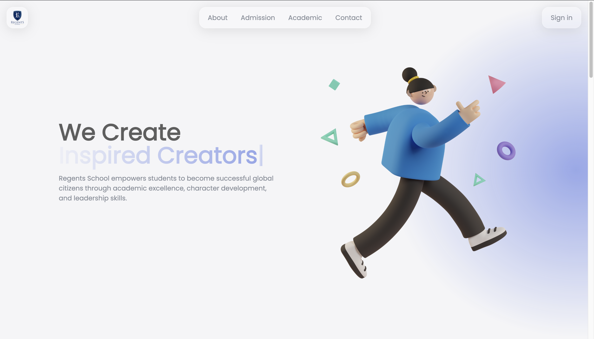
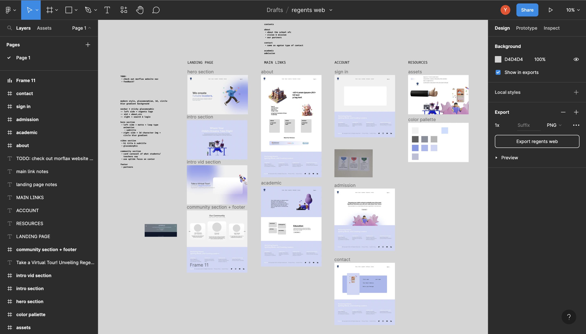

# Regents School Bali 

[Live Demo](https://yusei07.github.io/regents-v2/) :point_left:



I saw my [school website](https://www.regentsschoolbali.com/), and it seems it like hasn't been updated in quite a while, so I decided to make my own version of my school website !

## UI/UX Design



A minimalistic website design, that comes along with a couple of components such as glassmorphism, gradient, and 3D image.

## Stack

- [Swiper.js](https://swiperjs.com/) - Swiper JS is a versatile JavaScript library for creating touch-enabled sliders and carousels.
- [Typed.js](https://threejs.org/) - JavaScript library for creating animated typing effects on web pages.
- [AOS (Animate On Scroll)](https://www.framer.com/motion/) - JavaScript library for adding scroll-triggered animations to web elements.

## Project Structure

```
$PROJECT_ROOT
│   # Main file
├── assets
│   # General images
├──── png
│     # PNG images
├──── svg
│     # SVG format
├── src
│   # File pages
├──── styles
│     # Page styles
└───── scripts
      # Page scripts
```

## What I Learned
- Figma
- UI/UX design
- Responsive design
- Image optimisation

---

## Creds
- [Saly 3D illustration](https://www.figma.com/community/file/890095002328610853)
- [Midjourney](https://www.midjourney.com/home/?callbackUrl=%2Fapp%2F)
